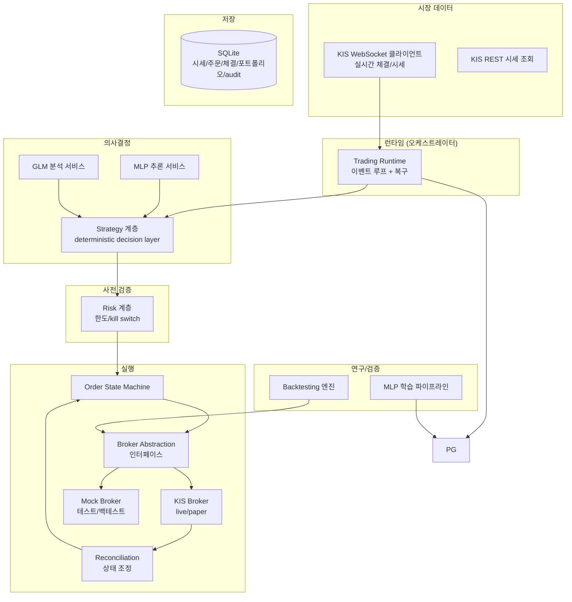
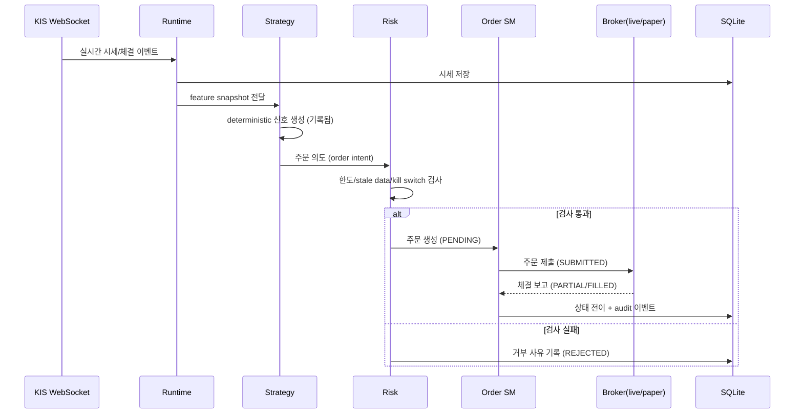

# LossFunction 시스템 아키텍처

> 본 문서는 이후 모든 구현 카드의 기준점이다. 모듈 경계나 책임을 변경하는 카드는
> 반드시 이 문서를 먼저 갱신한 뒤 구현한다 (`doc/kanban/` 카드가 이 문서를 의존한다).

## 1. 시스템 개요

LossFunction은 한국투자증권(KIS) Open API 위에서 동작하는 오픈소스 자동투자 시스템이다.

- **대상 시장**: 국내 주식 우선
- **운영 형태**: OCI에서 24/7 무인 운영, Docker 컨테이너
- **언어/플랫폼**: Python 3.11+, REST + WebSocket
- **핵심 원칙**: deterministic strategy/risk/order, 전 상태 auditability, restart/recovery

## 2. 컴포넌트 다이어그램



## 3. 데이터 흐름 (정상 경로)



실패 경로(핵심 불변식):

1. **주문 timeout** → 주문을 FAILED로 표시하지 않는다. `UNKNOWN`으로 전이 후
   reconciliation이 broker측 실제 상태를 확인할 때까지 재시도 금지.
2. **재시작** → 미결제(open) 주문 전수 reconciliation 후에야 새 주문 허용.
3. **중복 주문** → 주문은 idempotency key(client order id)로 식별되고, 동일 key의
   재제출은 차단된다.

## 4. 모듈 경계와 인터페이스 책임

패키지 루트: `src/lossfunction/` — 의존 방향은 항상 아래 방향(하위 모듈은 상위 모듈을
import하지 않는다).

| 모듈 | 책임 | 하지 않는 것 |
|---|---|---|
| `domain/` | Order, Position, Portfolio, Fill 순수 모델 + 불변식 | 네트워크 I/O, DB, 외부 라이브러리 의존 |
| `broker/` | `Broker` 추상 인터페이스, KIS live/paper 구현, mock 구현 | 전략 판단, 리스크 판단 |
| `marketdata/` | 시세 수신(WS), 시세 조회(REST), 도메인 이벤트 변환 | 주문 결정 |
| `strategy/` | `Strategy` 인터페이스, deterministic decision layer, 신호 기록 | 직접 주문 제출 |
| `risk/` | 주문 사전 검증: 포지션/집중도/손실 한도, drawdown, stale data, kill switch | 전략 신호 변경 |
| `execution/` | order state machine, reconciliation, duplicate 방지 | 한도 결정 |
| `storage/` | SQLite 스키마(WAL), 저장 계층, audit 로그 | 비즈니스 규칙 |
| `runtime/` | 이벤트 루프, 컴포넌트 조립, restart/recovery 절차 | 도메인 규칙 |
| `backtest/` | 이벤트 시뮬레이션, 수수료/세금/슬리피지, look-ahead 차단 | 실계좌 접근 |
| `ml/` | MLP feature/학습/추론/버전관리, GLM 분석 스키마 검증 | 실시간 주문 경로 직접 제어 |
| `config/` | 설정 로드/검증, 환경(paper/live) 정의 | 기본값 하드코딩 |

핵심 인터페이스 (구현 카드에서 세부 확정):

- `Broker`: 주문 제출/취소/정정, 잔고 조회, 주문 상태 조회, 시세 구독 — KIS 의존이
  이 경계를 넘지 못한다.
- `Strategy`: feature snapshot → 주문 의도(order intent) 목록. 순수 함수에 가깝게:
  동일 입력에 동일 출력, 내부 상태는 명시적으로 주입.
- `Risk`: (order intent, portfolio 상태, 시장 상태) → 승인/거부 + 사유.
- `OrderStateMachine`: 상태 전이 규칙의 유일한 소유자. 다른 모듈은 주문 상태를
  직접 바꾸지 않는다.

## 5. Paper/Live 환경 분리 원칙

1. **기본값은 paper다.** `TRADING_MODE` 설정이 명시적으로 `live`여야 live broker가
   조립된다.
2. **live 진입은 명시적 확인 절차를 요구한다.** 단순 환경변수 하나로 live 주문이
   나가지 않도록, 설정 조합 검증(예: `LIVE_TRADING_CONFIRMED=true` 별도 확인)이 필요하다.
3. **동일 코드 경로.** paper/live는 `Broker` 구현체 선택으로만 갈린다. 전략/리스크/
   상태머신 코드는 모드를 모른다.
4. **모드는 모든 trace에 기록된다.** 주문, audit 이벤트, 로그에 paper/live 여부가
   남아 사후 추적이 가능하다.
5. **secret은 저장소에 없다.** API key/secret/계좌번호는 환경변수 또는 배포
   시크릿으로만 주입되고, `.gitignore`와 검사로 유출을 차단한다.

## 6. 결정 기록

| 결정 | 근거 |
|---|---|
| 이벤트 중심 단일 프로세스 | 24/7 단일 인스턴스 운영에 충분하고, 분산 시스템 복잡도(네트워크 파티션 시 주문 정합성) 회피 |
| 상태 변경은 전부 audit 이벤트로 기록 | auditability 요구사항, restart/recovery의 원천 데이터 |
| reconciliation 우선 원칙 | timeout ≠ 실패. broker가 사실의 원천(source of truth)이며 로컬 상태는 조정 대상 |
| MLP/GLM은 주문 경로에서 advisory | 비결정적 구성요소가 직접 주문을 내지 못하게 하여 deterministic 원칙 보존 |
| 도메인 모듈은 외부 의존 금지 | 테스트 용이성 + KIS/DB 교체 가능성 |

## 7. 운영 토폴로지 (목표)

```
OCI VM
└── Docker
    └── lossfunction-runtime        (거래 런타임, paper/live)
        └── /data/lossfunction.db   (SQLite 단일 파일 볼륨 — 상태/audit)
```

재시작 시나리오: 컨테이너 재기동 → 저장계층에서 포트폴리오/미결제 주문 복구 →
open order reconciliation → WebSocket 재구독 → 신규 주문 허용.
